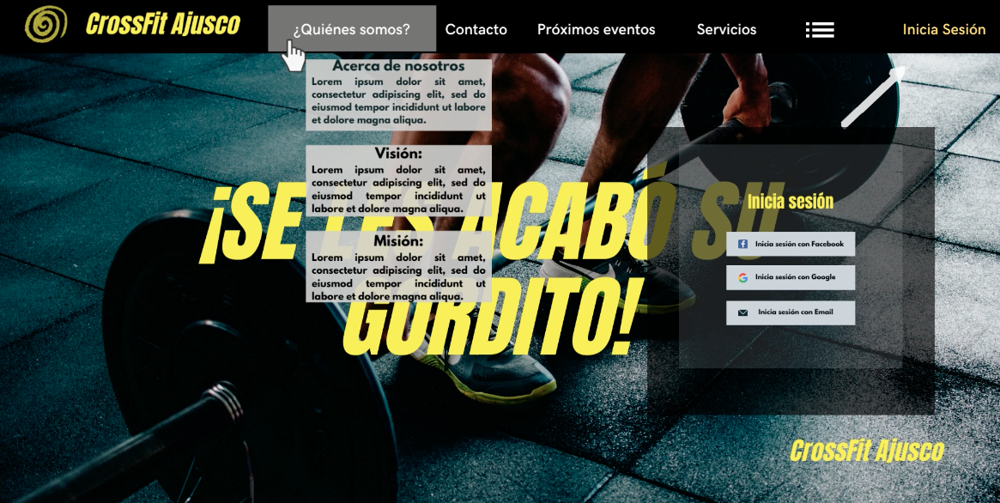
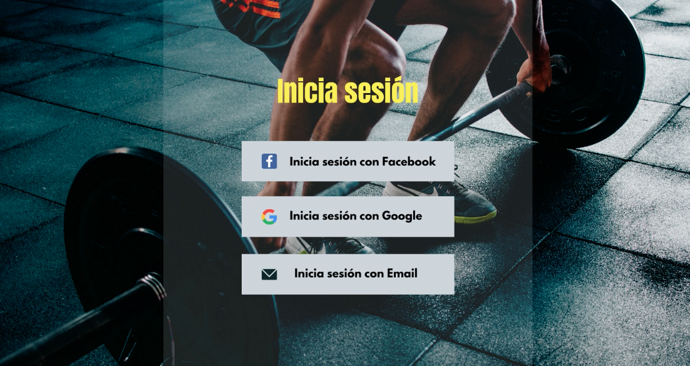
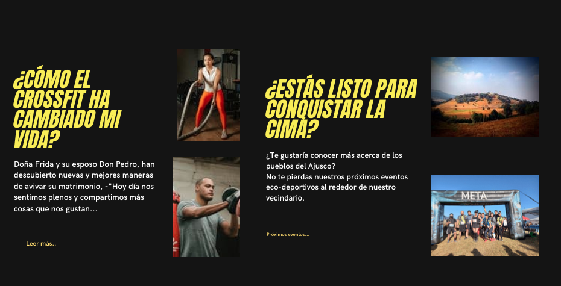
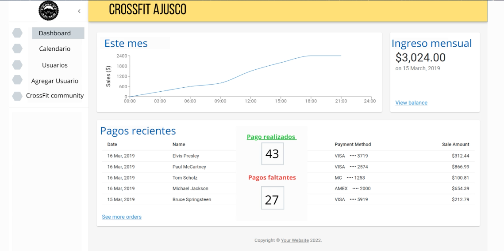
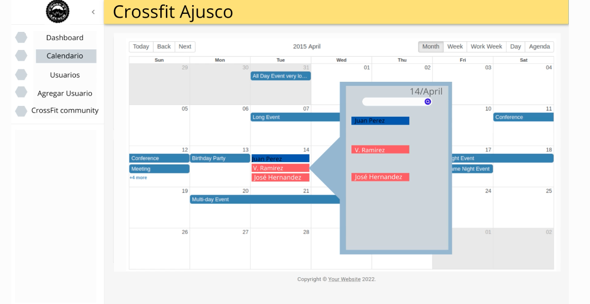
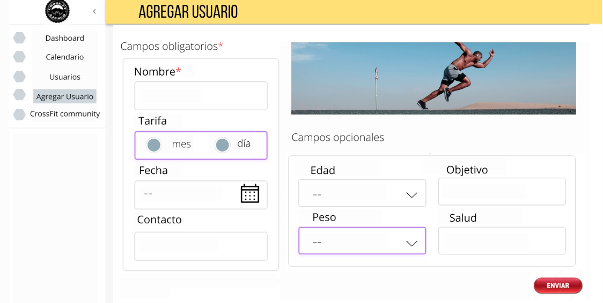
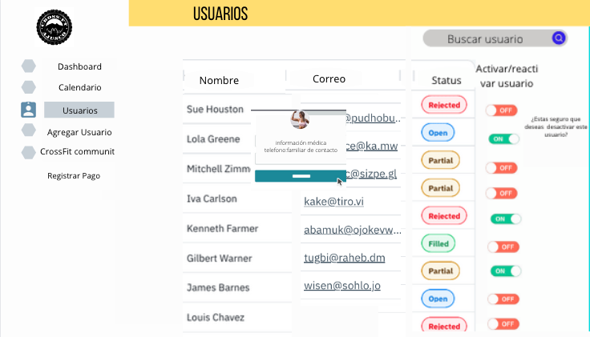

# CrossFt Website Project

---

Index

    1. Description
    2. User Definition & User Stories (UX)
    3. Workflow Process
    4. Prototype Design

---

## 1. Description

In this project our team work for develop a web application available for mobile and desktop devices.

The website is built with React JS and firestore database.
Our client is a CrossFit teacher who lives in Ajusco, and requires a tool to help him improve his business and interaction with his users.

## 2. User Stories

**For the teacher of CrossFt Ajusco:**

- The user wishes to view the dates, names and payment status of each of his clients.

- The user requires a simple and friendly way to interact with their clients, share exercise routines and events related to their discipline.

**For the customers:**

The interface should allow the customers:

- Log-in
  - With Google or Facebook
  - Email
- See the news Feed of the Social Network
- Showing at least the title, date of published, Content (img & text), for each publication.
- Show the list of all the users registered with profile picture and name

- Publish

## 3. Workflow process

The agile methodology is used to distribute the tasks of the project

## 4. UX/UI Interface

Landing page

Administration Interface

Users Interface

